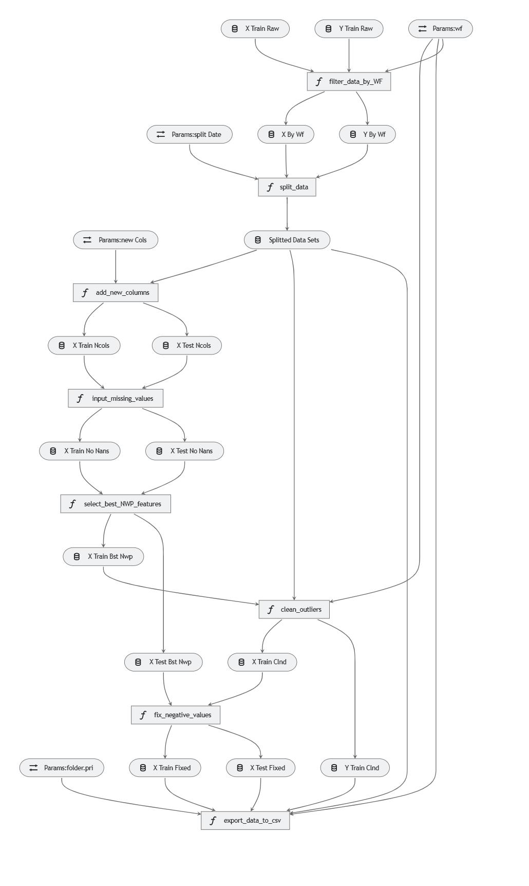

# Wind Power Forecasting - Application tool

This repository contains the source code of my Final Master's degree project in [Decision Systems Engineering](https://www.urjc.es/estudios/master/915-ingenieria-de-sistemas-de-decision), titled *Wind Power Forecasting using Machine Learning techniques*, coursed in Rey Juan Carlos University. It is based on the [Data Science challenge](https://challengedata.ens.fr/participants/challenges/34/) posed by the *Compagnie nationale du Rhône*. 

For further information, you can read the master's thesis [here](dissertation.pdf).

## Introduction
This application is intended to be a flexible and configurable tool in order to easily build and analyze models for this forecasting problem. It is based on [Kedro](https://kedro.readthedocs.io/en/stable/index.html) API for the sake of applying software engineering best practices to data and machine-learning pipelines. [MLflow tracking](https://mlflow.org/) is used to record and query experiments (code, data, config, and results).

## Instalation
The packages to re-create the necessary conda environment are listed in `./requirements.txt`.

## Implemented pipelines
The main pipelines implemented are:
1. Prepare data for EDA (`eda`). Transforms raw data into a proper format for Exploratory Data Analisys.
2. Data engineering (`de`). Gets the data ready to be consumed by Machine Learning algorithms.
3. Feature engineering (`fe`). Allows to explore and add new features to the data sets.
4. Modeling (`mdl`). Trains the selected algorithm from among the following: MARS, KNN, RF, SVM. It aslo optimizes model hyperparameters and make predictions on the test set.

There are other two additional pipelines:
1. CNR pipeline. It contains several subpipelines to get predictions and submission file for the CNR Data Science Challenge.
2. Neural Networks. In progress ...

## Configuration files
There are configuration files for every pipeline consisting of `prameters.yml` and `catalog.yml` files. The first one contains all the parameters required for the pipeline run. The second is the project-shareable Data Catalog.  It's a registry of all data sources available for use by the project and it manages loading and saving of data. Both configuration files are located at `conf/base`.

## CLI commands
As a kedro application, the CLI can be used to run pipelines, among all other options you can check in kedro documentation. To run the main pipelines of this project these are some basic command examples, choosing the Wind Farm  (`wf`) and the algorithm (`alg`) to build the model:
1. Prepare data for EDA: `kedro run --pipeline eda --params wf:WF1,alg:KNN`
2. Data engineering: `kedro run --pipeline de --params wf:WF1`
3. Feature engineering: `kedro run --pipeline fe --params wf:WF1,max_k_bests:3`
4. Modeling: `kedro run --piepeline mdl --params wf:WF1,alg:KNN`

You can overrite any parameter value defined in parameter configuration files, as well as the the data set used as the first input whenever it is defined in any of the existing data catalogs. 

**Important**: It's necessary to put raw data in `data/01_raw/`. Raw data is available [here](https://challengedata.ens.fr/challenges/34) (free registration for the challenge is required).

## Pipeline visualization
Using the plugin `kedro-viz` (need to be installed) by running `kedro viz`, you'll visualize  data and machine-learning pipelines. For instance, this is the visualization of data enegineering pipeline:

## Other useful commands
* Mlflow tracking ui: `kedro mlflow ui`. It serves the tracking tool as a web on localhost (by default port 5000)
* Jupyter notebook: `kedro jupyter notebook`. It lauches jupyter notebook loading all the kedro context variables so you can easily access pipelines, data catalogs, parameters and many other useful stuff from your notebook.

To use `mlflow ui` you need to install the plugin [kedro-mlflow](https://github.com/Galileo-Galilei/kedro-mlflow).

